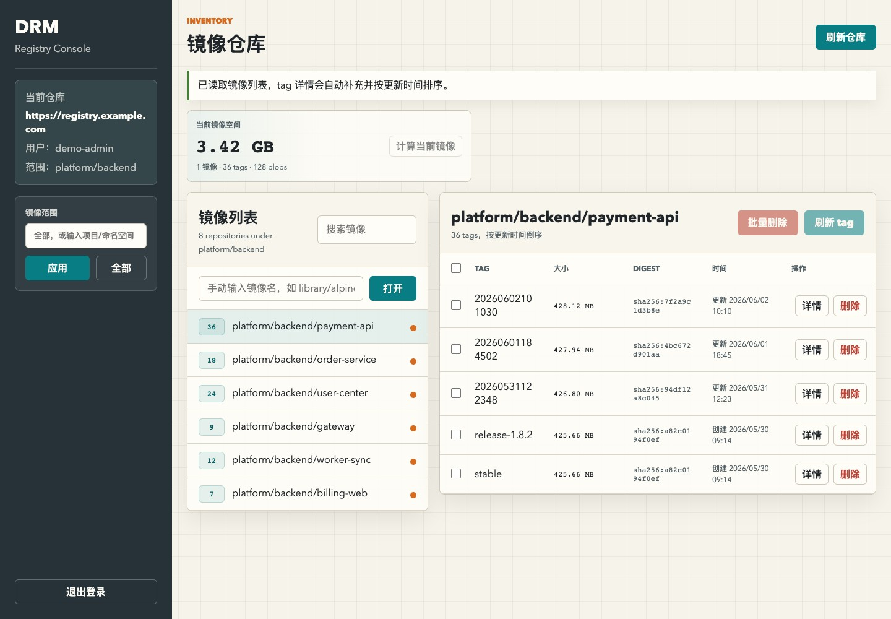
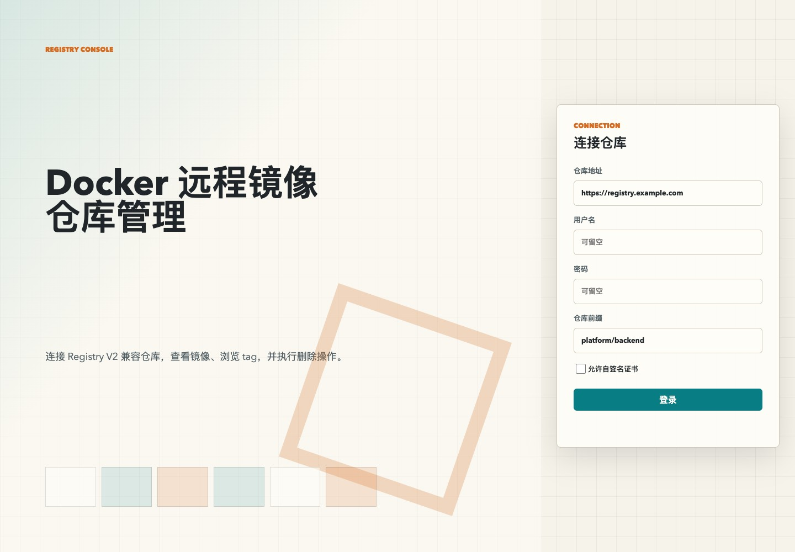

# Registry Console

<p align="center">
  
</p>

<p align="center">
  <a href="https://www.python.org/"></a>
  
  
  
  <a href="LICENSE"></a>
</p>

<p align="center">
  <strong>English</strong> | <a href="README_ZH.md">中文</a>
</p>

A zero-dependency Python web console for managing Docker Registry HTTP API V2 compatible remote image registries. It is designed for local or intranet use: browse repositories, inspect tags, view digest/size/time metadata, estimate per-repository image usage, and delete tags individually or in batches.

## Preview

### Login



### Dashboard


## Highlights

- Zero third-party Python dependencies.
- Supports anonymous registries, Basic Auth, and Bearer token challenge.
- Supports repository prefix/namespace filtering during login or after login.
- Shows async tag counts beside each repository in the repository list.
- Auto-loads tag size, digest, and time metadata.
- Sorts tags by the readable update time in descending order.
- Estimates current repository usage by unique blob digest, so shared layers across tags are counted once.
- Supports single-tag deletion and batch deletion.

## Requirements

- Python 3.10+
- Network access from the running machine to the target Docker Registry
- A target registry compatible with Docker Registry HTTP API V2

No Python package installation is required.

## Quick Start

```bash
git clone https://github.com/tangguo95/registry-console.git
cd registry-console
python3 app.py
```

Default URL:

```text
http://127.0.0.1:8765
```

Open the URL in a browser and fill in:

- Registry URL: for example `https://registry.example.com`
- Username: optional for anonymous registries
- Password: optional for anonymous registries
- Repository prefix: optional, for example `project-a/team-b`

## Run Options

Listen on localhost:

```bash
python3 app.py --host 127.0.0.1 --port 8765
```

Listen on all interfaces for LAN access:

```bash
python3 app.py --host 0.0.0.0 --port 8765
```

Then visit:

```text
http://SERVER_IP:8765
```

If you expose it beyond your own machine, use a reverse proxy, HTTPS, and proper access control.

## Background Run

Run with `nohup`:

```bash
nohup python3 app.py --host 127.0.0.1 --port 8765 > docker_remote_manage.log 2>&1 &
```

Find the process:

```bash
lsof -nP -iTCP:8765 -sTCP:LISTEN
```

Stop it:

```bash
kill <PID>
```

On macOS, you can temporarily manage it with `launchctl`:

```bash
launchctl submit -l registry_console \
  -o /tmp/registry_console.log \
  -e /tmp/registry_console.log \
  -- /bin/zsh -lc 'cd /path/to/registry-console && python3 app.py --host 127.0.0.1 --port 8765'
```

Stop it:

```bash
launchctl remove registry_console
```

## Usage

1. Open `http://127.0.0.1:8765`.
2. Enter the Registry URL, username, and password.
3. Optionally set a repository prefix to limit the visible repositories.
4. Select a repository from the left panel.
5. Inspect tags, size, digest, and time metadata on the right.
6. Select multiple tags to delete them in a batch.
7. Use the current repository usage panel to estimate unique blob usage for the selected repository.

## Project Structure

```text
registry-console/
├── app.py
├── README.md
├── README_ZH.md
├── docs/
│   └── images/
│       ├── dashboard.jpg
│       └── login.jpg
└── static/
    ├── app.js
    ├── index.html
    └── styles.css
```

`app.py` contains the HTTP server and Registry API integration. `static/` contains the frontend. `docs/images/` contains README preview images.

## API Coverage

The tool mainly uses these Registry V2 APIs:

- `GET /v2/`
- `GET /v2/_catalog`
- `GET /v2/<name>/tags/list`
- `GET /v2/<name>/manifests/<reference>`
- `GET /v2/<name>/blobs/<digest>`
- `DELETE /v2/<name>/manifests/<digest>`

## FAQ

### The port is already in use

```bash
lsof -nP -iTCP:8765 -sTCP:LISTEN
python3 app.py --port 8766
```

### Why do I need to log in again after restarting the service?

Credentials are stored only in the current Python process memory session. Restarting the service clears the session.

### What if the password contains special characters?

Passwords entered in the web page do not need escaping.

If you test with Docker CLI and the password contains characters such as `!`, `@`, or `%`, prefer:

```bash
printf '%s' 'your-password' | docker login registry.example.com -u 'username' --password-stdin
```

Do not pass such passwords directly after `-p` in zsh, because shell history expansion may interfere.

### Why is storage not released immediately after deletion?

Deleting a manifest from Docker Registry usually only removes the reference. The registry often needs garbage collection before storage is actually released.

### Why is the usage estimate different from real disk usage?

The usage estimate is based on manifest/config/layer descriptors readable from Registry V2 API. It is not the same as backend filesystem usage. Registry V2 also does not provide total capacity or remaining capacity.

### Why is the upload time not always accurate?

Docker Registry V2 usually does not provide an exact push time. This tool prefers the manifest response header `Last-Modified`, and falls back to the image config `created` field.

## Security Notes

- Listening on `127.0.0.1` is recommended by default.
- For team use, put it inside an intranet and add HTTPS, authentication, audit logging, and CSRF protection.
- Login credentials are stored only in the current Python process memory and are not written to local files.

## AI-Assisted Development

This project was designed, implemented, documented, and polished with the assistance of OpenAI Codex (GPT-5.5), under the author's direction and review.

## Contact

- Author: tangguo95
- Email: 545496535@qq.com

## License

This project is released under the [MIT License](LICENSE).

## References

- Docker Distribution / Registry HTTP API V2: https://distribution.github.io/distribution/spec/api/
- Docker Registry authentication: https://docs.docker.com/reference/api/registry/auth/
